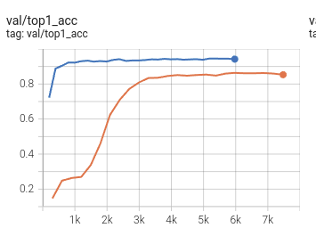

# Details
- X3D-S, ucf101, RGB.

AdamW:
```python
# optimizer
optimizer = dict(type='AdamW', lr=1e-3)
optimizer_config = dict(grad_clip=None)
# learning policy
lr_config = dict(policy='CosineAnnealing',
                 min_lr=0,
                 warmup='linear',
                 warmup_ratio=0.1,
                 warmup_iters=2.5,
                 warmup_by_epoch=True)
total_epochs = 30

```
SGD:
```python
# optimizer
optimizer = dict(
    type='SGD',
    lr=1e-3,
    momentum=0.9,
    weight_decay=0.0001)
optimizer_config = dict(grad_clip=dict(max_norm=40, norm_type=2))
# learning policy
lr_config = dict(policy='step', step=[20, 40])
total_epochs = 50

```
# Validation curve 
Blue:   AdamW 30
Orange: SGD



# Test results comparison