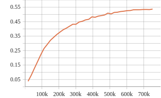

# Config
```python
model = dict(
    type='Recognizer3D',
    backbone=dict(type='X3D', gamma_w=1, gamma_b=2.25, gamma_d=2.2),
    cls_head=dict(
        type='X3DHead',
        in_channels=432,
        num_classes=400,
        spatial_type='avg',
        dropout_ratio=0.5,
        fc1_bias=False),
    train_cfg=None,
    test_cfg=dict(average_clips='prob'))
dataset_type = 'VideoDataset'
data_root = 'my_data/kinetics400/videos_train'
data_root_val = 'my_data/kinetics400/videos_val'
ann_file_train = 'my_data/kinetics400/kinetics400_train_list_videos.txt'
ann_file_val = 'my_data/kinetics400/kinetics400_val_list_videos.txt'
ann_file_test = 'my_data/kinetics400/kinetics400_val_list_videos.txt'
img_norm_cfg = dict(
    mean=[123.675, 116.28, 103.53], std=[58.395, 57.12, 57.375], to_bgr=False)
train_pipeline = [
    dict(type='DecordInit'),
    dict(type='SampleFrames', clip_len=16, frame_interval=4, num_clips=1),
    dict(type='DecordDecode'),
    dict(type='Resize', scale=(-1, 128)),
    dict(type='RandomResizedCrop'),
    dict(type='Resize', scale=(112, 112), keep_ratio=False),
    dict(type='Flip', flip_ratio=0.5),
    dict(
        type='Normalize',
        mean=[123.675, 116.28, 103.53],
        std=[58.395, 57.12, 57.375],
        to_bgr=False),
    dict(type='FormatShape', input_format='NCTHW'),
    dict(type='Collect', keys=['imgs', 'label'], meta_keys=[]),
    dict(type='ToTensor', keys=['imgs', 'label'])
]
val_pipeline = [
    dict(type='DecordInit'),
    dict(
        type='SampleFrames',
        clip_len=16,
        frame_interval=4,
        num_clips=1,
        test_mode=True),
    dict(type='DecordDecode'),
    dict(type='Resize', scale=(-1, 128)),
    dict(type='CenterCrop', crop_size=112),
    dict(
        type='Normalize',
        mean=[123.675, 116.28, 103.53],
        std=[58.395, 57.12, 57.375],
        to_bgr=False),
    dict(type='FormatShape', input_format='NCTHW'),
    dict(type='Collect', keys=['imgs', 'label'], meta_keys=[]),
    dict(type='ToTensor', keys=['imgs'])
]
test_pipeline = [
    dict(type='DecordInit'),
    dict(
        type='SampleFrames',
        clip_len=16,
        frame_interval=4,
        num_clips=10,
        test_mode=True),
    dict(type='DecordDecode'),
    dict(type='Resize', scale=(-1, 128)),
    dict(type='ThreeCrop', crop_size=112),
    dict(
        type='Normalize',
        mean=[123.675, 116.28, 103.53],
        std=[58.395, 57.12, 57.375],
        to_bgr=False),
    dict(type='FormatShape', input_format='NCTHW'),
    dict(type='Collect', keys=['imgs', 'label'], meta_keys=[]),
    dict(type='ToTensor', keys=['imgs'])
]
data = dict(
    videos_per_gpu=32,
    workers_per_gpu=2,
    test_dataloader=dict(videos_per_gpu=1),
    train=dict(
        type='VideoDataset',
        ann_file='my_data/kinetics400/kinetics400_train_list_videos.txt',
        data_prefix='my_data/kinetics400/videos_train',
        pipeline=[
            dict(type='DecordInit'),
            dict(
                type='SampleFrames',
                clip_len=16,
                frame_interval=4,
                num_clips=1),
            dict(type='DecordDecode'),
            dict(type='Resize', scale=(-1, 128)),
            dict(type='RandomResizedCrop'),
            dict(type='Resize', scale=(112, 112), keep_ratio=False),
            dict(type='Flip', flip_ratio=0.5),
            dict(
                type='Normalize',
                mean=[123.675, 116.28, 103.53],
                std=[58.395, 57.12, 57.375],
                to_bgr=False),
            dict(type='FormatShape', input_format='NCTHW'),
            dict(type='Collect', keys=['imgs', 'label'], meta_keys=[]),
            dict(type='ToTensor', keys=['imgs', 'label'])
        ]),
    val=dict(
        type='VideoDataset',
        ann_file='my_data/kinetics400/kinetics400_val_list_videos.txt',
        data_prefix='my_data/kinetics400/videos_val',
        pipeline=[
            dict(type='DecordInit'),
            dict(
                type='SampleFrames',
                clip_len=16,
                frame_interval=4,
                num_clips=1,
                test_mode=True),
            dict(type='DecordDecode'),
            dict(type='Resize', scale=(-1, 128)),
            dict(type='CenterCrop', crop_size=112),
            dict(
                type='Normalize',
                mean=[123.675, 116.28, 103.53],
                std=[58.395, 57.12, 57.375],
                to_bgr=False),
            dict(type='FormatShape', input_format='NCTHW'),
            dict(type='Collect', keys=['imgs', 'label'], meta_keys=[]),
            dict(type='ToTensor', keys=['imgs'])
        ]),
    test=dict(
        type='VideoDataset',
        ann_file='my_data/kinetics400/kinetics400_val_list_videos.txt',
        data_prefix='my_data/kinetics400/videos_val',
        pipeline=[
            dict(type='DecordInit'),
            dict(
                type='SampleFrames',
                clip_len=16,
                frame_interval=4,
                num_clips=10,
                test_mode=True),
            dict(type='DecordDecode'),
            dict(type='Resize', scale=(-1, 128)),
            dict(type='ThreeCrop', crop_size=112),
            dict(
                type='Normalize',
                mean=[123.675, 116.28, 103.53],
                std=[58.395, 57.12, 57.375],
                to_bgr=False),
            dict(type='FormatShape', input_format='NCTHW'),
            dict(type='Collect', keys=['imgs', 'label'], meta_keys=[]),
            dict(type='ToTensor', keys=['imgs'])
        ]))
optimizer = dict(type='AdamW', lr=0.0001, weight_decay=0.05)
optimizer_config = dict(grad_clip=dict(max_norm=1.0))
lr_config = dict(
    policy='CosineAnnealing',
    min_lr_ratio=0.01,
    warmup='linear',
    warmup_ratio=0.01,
    warmup_iters=20,
    warmup_by_epoch=True)
total_epochs = 200
evaluation = dict(
    interval=5, metrics=['top_k_accuracy', 'mean_class_accuracy'])
checkpoint_config = dict(interval=5)
log_config = dict(
    interval=200,
    hooks=[dict(type='TextLoggerHook'),
           dict(type='TensorboardLoggerHook')])
dist_params = dict(backend='nccl')
log_level = 'INFO'
load_from = None
resume_from = None
workflow = [('train', 1)]
opencv_num_threads = 0
mp_start_method = 'fork'
work_dir = './work_dirs/x3d_m_16x6x1_kinetics400_video/'
gpu_ids = range(0, 2)
omnisource = False
module_hooks = []
```

# Val curve


# Test result
```shell
==========================
top1_acc: 0.6090
top5_acc: 0.8353
==========================
```