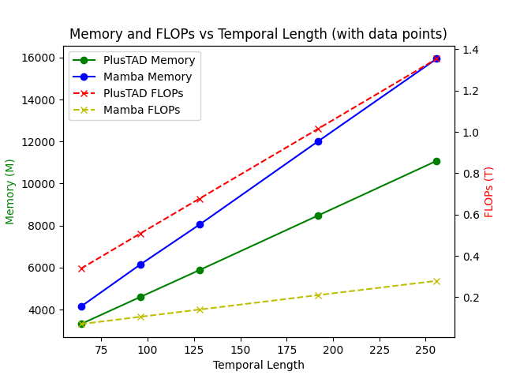

# Backbone
x3d:
==============================
Input shape: (1, 3, 16, 224, 224)
Flops: 4.97 GFLOPs
Params: 3.79 M
==============================

i3d:
==============================
Input shape: (1, 3, 16, 224, 224)
Flops: 16.68 GFLOPs
Params: 28.04 M
==============================

i3d_sony:
==============================
Input shape: (1, 3, 16, 224, 224)
Flops: 27.86 GFLOPs
Params: 12.7 M
==============================

Interesting, it seems that the x3d is the smallest model, at least smaller than i3d_sony.
But when I use x3d backbone in APN, the batch size have to be reduced to **8** to avoid OOM error, 
which can be up to **20** when using i3d_sony backbone under the same setting (two 1080 ti). 

# TAD models
(4090Ti, CUDA=12.1, Torch=2.1.2, Inference-time FLOPs and Training-time Memory are recorded)
(Mamba: 10.68M parameters, PlusTAD: 40.84M parameters)

|                   | PlusTAD          |          | Mamba            |           |
|-------------------|------------------|----------|------------------|-----------|
| Input Shape       | Memory (M)       | FLOPs (G)| Memory (M)       | FLOPs (G) |
| (1, 64, 224, 224) | 3310             | 338      | 4142             | 70        |
| (1, 96, 224, 224) | 4597             | 508      | 6142             | 105       |
| (1, 128, 224, 224)| 5881             | 677      | 8046             | 140       |
| (1, 192, 224, 224)| 8480             | 1015     | 12014            | 210       |
| (1, 256, 224, 224)| 11083            | 1354     | 15944            | 279       |

